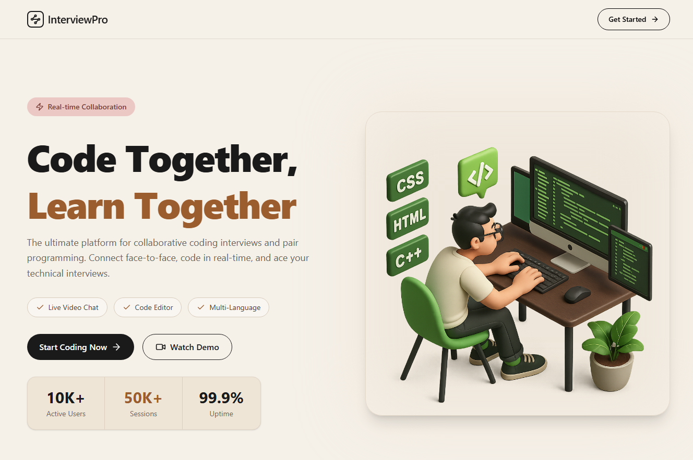

# InterviewPro

A real-time collaborative technical interview platform that enables developers to conduct coding interviews with integrated video calling, live chat, coding challenges, code execution, and session management.



---

## Features

### Authentication & User Management
- Clerk Authentication
- Secure protected routes
- User onboarding and profile creation
- JWT-based backend authorization

### Interview Sessions
- Create interview sessions
- Join active sessions
- End sessions
- Host and participant roles
- Session status tracking (active/completed)

### Real-Time Video Calling
- Stream Video SDK integration
- Video/audio controls
- Screen sharing support
- Participant management
- Auto reconnect support

### Real-Time Chat
- Stream Chat integration
- Session-specific chat channels
- Persistent messaging
- Participant synchronization

### Coding Environment
- Monaco-based code editor
- Multiple programming languages
- Starter code templates
- Syntax highlighting
- Code execution using Piston API

### Problem Management
- Curated DSA problems
- Difficulty levels
  - Easy
  - Medium
  - Hard
- Constraints
- Examples
- Problem descriptions

### Dashboard
- Active interview sessions
- Recent completed sessions
- Session statistics
- Quick session creation

### Session Lifecycle Management
- Heartbeat-based activity tracking
- Automatic abandoned session detection
- Session cleanup workflow
- Video call resource cleanup
- Chat channel cleanup

---

## Tech Stack

### Frontend
- React
- Vite
- TailwindCSS
- DaisyUI
- TanStack Query
- Clerk React SDK
- Stream Video React SDK
- Stream Chat React SDK
- Monaco Editor

### Backend
- Node.js
- Express.js
- MongoDB
- Mongoose
- Clerk Express SDK
- Inngest

### Third Party Services
- Clerk (Authentication)
- Stream (Video & Chat)
- Piston API (Code Execution)
- MongoDB Atlas

---

## Architecture

Frontend
```
React + Vite
│
├── Clerk Authentication
├── TanStack Query
├── Stream Video SDK
├── Stream Chat SDK
└── Monaco Editor
```

Backend
```
Express API
│
├── Authentication Middleware
├── Models
  ├── Session
  ├── Users
├── Lib
  ├── Stream Integration
  ├── Inngest Jobs
  ├── Database connection
├── Routes
  ├── Chat Routes
  ├── Session Routes

```

---

## Session Flow

### Create Session

Host creates a session

```
Host
 │
 ▼
Create Session
 │
 ▼
MongoDB Session
 │
 ▼
Stream Video Call
 │
 ▼
Stream Chat Channel
```

### Join Session

```
Participant
 │
 ▼
Join Session
 │
 ▼
Participant Added
 │
 ▼
Chat Channel Updated
 │
 ▼
Video Call Joined
```

### End Session

```
End Session
 │
 ▼
Delete Stream Call
 │
 ▼
Delete Chat Channel
 │
 ▼
Mark Session Completed
```

---

## Heartbeat System

To prevent abandoned sessions from remaining active indefinitely, a heartbeat mechanism is implemented.

### Flow

```
Session Open
     │
     ▼
Heartbeat Every 2 Minutes
     │
     ▼
Update lastActivityAt
```

### Purpose

Detect:

- Closed browser tabs
- Browser crashes
- Lost connections
- Abandoned sessions

---

## Automatic Cleanup

Inactive sessions are automatically detected using:

- `lastActivityAt`
- Scheduled Inngest jobs

Cleanup actions:

- Mark session completed
- Delete Stream video call
- Delete Stream chat channel

---

## Database Models

### User

```js
{
  name,
  email,
  profileImg,
  clerkId
}
```

### Session

```js
{
  problem,
  difficulty,
  host,
  participants,
  status,
  callId,
  lastActivityAt
}
```

---

## Environment Variables

### Frontend

```env
VITE_API_URL=
VITE_CLERK_PUBLISHABLE_KEY=
VITE_STREAM_API_KEY=
```

### Backend

```env
PORT=
MONGO_URI=

CLERK_SECRET_KEY=
CLERK_PUBLISHABLE_KEY=

STREAM_API_KEY=
STREAM_API_SECRET=

INNGEST_EVENT_KEY=
INNGEST_SIGNING_KEY=
```

---

## Running Locally

### Frontend

```bash
cd frontend
npm install
npm run dev
```

### Backend

```bash
cd backend
npm install
npm run dev
```

### Inngest

```bash
npx inngest-cli@latest dev
```

---

## Future Improvements

- Collaborative live coding using CRDT/WebSockets
- Shared editor synchronization
- Interview feedback generation using AI
- Session recordings
- Coding analytics
- Interview scoring system
- Whiteboard support
- Multi-participant interviews
- Interview scheduling

---

## Author

Divyansh Srivastava

Software Engineer

Built as a full-stack real-time interview platform using React, Node.js, MongoDB, Clerk, Stream, and Inngest.


## TODO / Future Roadmap

### High Priority

- [ ] Real-time collaborative code editor
  - Currently each participant has their own editor state.
  - Changes made by one user are not reflected to other participants.
  - Implement using WebSockets, Socket.IO, Yjs, or CRDT-based synchronization.

- [ ] Live cursor tracking
  - Show collaborator cursor positions.
  - Display participant names while typing.

- [ ] Session cleanup automation
  - Complete Inngest cron-based cleanup.
  - Automatically close abandoned sessions.
  - Delete orphaned Stream resources.

- [ ] Session reconnect handling
  - Recover interview session after browser refresh.
  - Restore chat and video state.

---

### Interview Experience

- [ ] AI interview feedback
  - Analyze code submissions.
  - Generate strengths and weaknesses.
  - Suggest improvements.

- [ ] Interview scoring system
  - Problem-solving score
  - Communication score
  - Code quality score
  - Overall performance score

- [ ] Interview notes panel
  - Allow interviewers to take notes during sessions.

- [ ] Session recording support
  - Record video calls.
  - Download recordings.

- [ ] Whiteboard collaboration
  - Draw diagrams.
  - Explain algorithms visually.

- [ ] Screen sharing improvements
  - Better screen-sharing controls.
  - Presentation mode.

---

### Coding Platform

- [ ] Test case execution
  - Run against hidden test cases.
  - Show pass/fail status.

- [ ] Custom input support
  - Execute code with user-provided input.

- [ ] Submission history
  - Track previous attempts.
  - Store execution results.

- [ ] Language-specific templates
  - JavaScript
  - Python
  - Java
  - C++
  - Go

- [ ] Auto-save editor state

- [ ] Code formatting support
  - Prettier integration
  - Language-specific formatters

---

### Session Management

- [ ] Session invitations
  - Share session links.
  - Invite participants directly.

- [ ] Scheduled interviews
  - Create future interview slots.
  - Calendar integration.

- [ ] Session analytics dashboard
  - Duration tracking.
  - Participation metrics.
  - Problem difficulty statistics.

- [ ] Session filtering
  - Filter by date.
  - Filter by difficulty.
  - Filter by status.

---

### User Features

- [ ] User profile page

- [ ] Session history page

- [ ] Leaderboard system

- [ ] Achievement badges

- [ ] Public interview portfolio

---

### DevOps & Infrastructure

- [ ] Docker support

- [ ] CI/CD pipeline

- [ ] Monitoring and logging

- [ ] Rate limiting

- [ ] Redis caching

- [ ] Error tracking (Sentry)

- [ ] Automated backups

---
